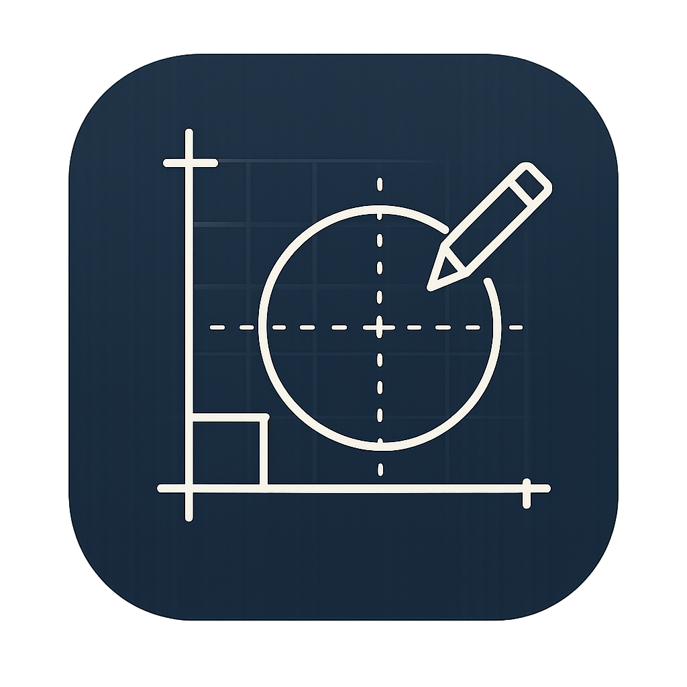

# SimpleCAD

Application de dessin technique légère pour macOS, construite avec SwiftUI et AppKit.

  

---

## Présentation

SimpleCAD est un éditeur de formes géométriques 2D orienté dessin technique. Il permet de placer, déplacer, redimensionner et annoter des formes sur un grand canevas, puis d'exporter le résultat en SVG standard. L'interface flottante (effet verre) s'efface au profit du dessin.

---

## Fonctionnalités

### Outils de dessin
| Outil | Raccourci | Comportement |
|-------|-----------|--------------|
| Sélectionner | `V` | Cliquer pour sélectionner, Maj-clic pour multi-sélection, glisser pour déplacer |
| Rectangle | `R` | Tracé libre |
| Carré | `Q` | Tracé contraint (côtés égaux) |
| Cercle | `C` | Tracé contraint (rayon) |
| Ellipse | `E` | Tracé libre |
| Triangle | `T` | Triangle isocèle |
| Ligne | `L` | Ligne horizontale |

> Maintenir **Maj** pendant le tracé contraint n'importe quel outil en carré/cercle.

### Navigation sur le canevas
- **Zoom** — `⌘+` / `⌘-` / `⌘0` (clavier principal et pavé numérique), boutons dans la barre d'outils, pinch trackpad
- **Pan** — Maintenir `Espace` + glisser
- **Déplacer une sélection** — Touches fléchées (1 px par pression)

### Propriétés des formes
- Couleur de remplissage et couleur de contour (sélecteur de couleur macOS)
- Épaisseur de contour (0.5 – 50 px, champ texte + stepper)
- Application instantanée à la sélection courante

### Annotations dimensionnelles
Lorsque l'option **Cotes** est activée, chaque forme sélectionnée affiche ses dimensions (largeur et hauteur) sous forme de cotation avec flèches. **Cliquer sur une cote** ouvre un champ de saisie inline pour entrer la valeur directement dans l'unité choisie (virgule ou point acceptés comme séparateur décimal).

### Gestion des calques
La barre latérale liste les calques dans l'ordre de rendu (le dernier dessiné en haut) :
- **Clic** pour sélectionner, **double-clic** pour renommer inline
- **Glisser-déposer** pour réordonner
- Boutons **Premier plan** / **Arrière-plan** (sidebar et menu Édition)

### Historique
L'onglet **Historique** de la barre latérale affiche une chronologie visuelle de toutes les actions (50 opérations + état initial). Cliquer sur n'importe quelle entrée ramène le document à cet état — équivalent à un annuler/rétablir multi-niveaux.

| Action | Raccourci |
|--------|-----------|
| Annuler | `⌘Z` |
| Rétablir | `⌘⇧Z` |

### Unités
8 unités disponibles via le sélecteur dans la barre d'outils : **mm, cm, m, km, in, ft, yd, mi**. Toutes les cotes, la barre de statut et les badges de la liste de calques s'expriment dans l'unité choisie. La conversion interne est basée sur 96 DPI (standard SVG : 1 in = 96 px).

### Fichiers
- **Nouveau** `⌘N` — réinitialise le document
- **Ouvrir** `⌘O` — ouvre un fichier `.svg` (via panneau ou glisser-déposer sur l'icône)
- **Enregistrer** `⌘S` — sauvegarde dans le fichier courant
- **Enregistrer sous** `⌘⇧S` — choisir un nouvel emplacement


---

## Format de fichier

SimpleCAD sauvegarde en **SVG standard** enrichi d'un espace de noms personnalisé `simplecad`. Les fichiers sont lisibles par n'importe quel éditeur SVG ; les métadonnées propres à SimpleCAD (type de forme, nom, dimensions en mm, unité du document) sont préservées à la relecture.

Exemple d'un élément exporté :
```xml
<rect x="100" y="200" width="300" height="150"
      fill="#FFFFFF" fill-opacity="1"
      stroke="#000000" stroke-opacity="1" stroke-width="2"
      simplecad:id="…" simplecad:name="Rectangle 1"
      simplecad:type="Rectangle"
      simplecad:x-mm="2.6" simplecad:y-mm="5.3"
      simplecad:width-mm="7.9" simplecad:height-mm="3.97"/>
```

---

## Architecture

```
SimpleCAD/
├── SimpleCADApp.swift              # Point d'entrée, menu macOS
├── Models/
│   ├── CADDocument.swift           # ObservableObject central (état + logique métier)
│   ├── CADShape.swift              # Modèle de forme + enums Tool/ShapeType/DocumentUnit
│   └── CADColor.swift              # Couleur RGBA sérialisable, pont NSColor/hex
├── Services/
│   └── SVGService.swift            # Sérialisation / désérialisation SVG
└── Views/
    ├── ContentView.swift           # Layout principal (canvas + sidebar + toolbar superposés)
    ├── ToolbarView.swift           # Barre d'outils flottante
    ├── CanvasView.swift            # NSView — dessin Core Graphics, souris, clavier
    ├── CanvasViewRepresentable.swift # Pont SwiftUI ↔ NSScrollView/CADCanvasView
    ├── ShapeListView.swift         # Liste des calques (drag-and-drop, renommage)
    ├── HistoryPanelView.swift      # Chronologie de l'historique
    └── StatusBarView.swift         # Barre de statut (outil, sélection, canevas)
```

### Flux de données

```
CADDocument (ObservableObject)
    │
    ├─ @Published → SwiftUI views (ToolbarView, ShapeListView, HistoryPanelView…)
    │
    └─ injected → CADCanvasView (NSView)
                      ├─ draw()  → Core Graphics
                      └─ events → document.addShape / moveSelectedShapes / …
```

`CADDocument` est l'unique source de vérité. Toutes les vues le lisent via `@EnvironmentObject`; les actions utilisateur appellent ses méthodes, qui mettent à jour `@Published var shapes` et déclenchent `recordAction()` pour l'historique.

### Points techniques notables

| Sujet | Détail |
|-------|--------|
| Canevas | 16 000 × 16 000 px, coordonnées Y vers le bas (flipped NSView, cohérent avec SVG) |
| Zoom | Délégué à `NSScrollView.magnification` (0.05 – 16×) ; synchronisé bi-directionnel avec `document.zoomLevel` |
| Historique | Tableau de snapshots `[CADShape]` limité à 51 entrées (état initial + 50 opérations) |
| Pan | Surveillance globale de la touche Espace via `NSEvent.addLocalMonitorForEvents` sans consommer les événements clavier des champs de texte |
| Éditeur de cotes | `NSTextField` overlay positionné précisément sur la zone de hit calculée à chaque redraw |
| Couleurs | Sélecteur macOS partagé (`NSColorPanel.shared`) via un coordinateur singleton |

---

## Prérequis

- macOS 26 ou ultérieur (utilise `GlassEffectContainer` / `.glassEffect`)
- Xcode 15+
- Aucune dépendance externe

## Compilation

```bash
open SimpleCAD.xcodeproj
# Product > Run  (⌘R)
```

---

## Raccourcis clavier

| Action | Raccourci |
|--------|-----------|
| Outils (sélection, formes) | `V` `R` `Q` `C` `E` `T` `L` |
| Tout sélectionner | `⌘A` |
| Tout désélectionner | `⌘D` |
| Supprimer la sélection | `⌫` |
| Déplacer (1 px) | `←` `→` `↑` `↓` |
| Annuler / Rétablir | `⌘Z` / `⌘⇧Z` |
| Premier plan / Arrière-plan | Menu Édition |
| Zoom avant / arrière / 100% | `⌘+` / `⌘-` / `⌘0` |
| Pan | `Espace` + glisser |
| Nouveau / Ouvrir / Enregistrer | `⌘N` / `⌘O` / `⌘S` |
| Enregistrer sous | `⌘⇧S` |
